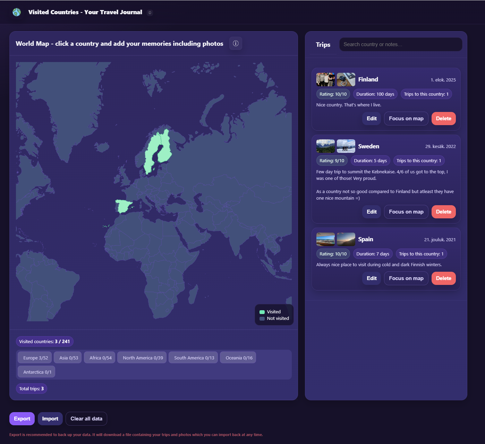

#### Result of 2 hour (+ few too many hours making it look perfect) vibecoding session because didn't find good enough product. I planned to run this only locally but since I really liked the outcome, decided to publish it as simple page at https://www.visited-countries.com/

#### Absolutely not my proudest product since didn't check basically anything what copilot was writing (expect some basic security things) but the end result very much satisfyes me.

# Visited Countries — Your Travel Journal

A tiny, privacy‑first, **client‑side** app to track the countries you’ve visited. Click a country on the map, log trips (date, rating, duration, notes) and attach a few photos. Everything lives in your browser (LocalStorage + IndexedDB). You can **Export** a portable JSON backup (including photos) and **Import** it on any device.

**Page running at:** https://www.visited-countries.com/



---

## Features
- 🗺️ **Interactive world map** (D3 + TopoJSON), pan & zoom; click to add trips
- 🧾 **Multiple trips per country** (date, 1–10 rating, duration in days, notes)
- 🖼️ **Per‑trip photos** (up to 3) — compressed in‑browser and stored locally
- 🔎 **Search** trips by country name or note text
- 🧭 **Focus on map** from any trip card
- 🧮 **Counters**: total countries visited, total trips, and per‑continent breakdown
- 📤 **Export** a JSON backup (includes photos as data URLs)
- 📥 **Import** a previously exported JSON (photos restored to IndexedDB)
- 🗑️ **Clear all** data (LocalStorage + IndexedDB)
- 🖼️ **Photo viewer** with keyboard (←/→/Esc) and touch swipe
- ♿ Basic ARIA labels for map and dialogs

> All logic runs **entirely in the browser**. No server, no tracking.

---

## Tech stack
- **D3 v7** for projections, zoom & rendering
- **TopoJSON (world‑atlas@2)** for country shapes and names
- **LocalStorage** for trip metadata
- **IndexedDB** for photo blobs
- Vanilla HTML/CSS/JS (ES modules via CDN)

---

## Data model
### Runtime storage (in‑browser)
- **LocalStorage key:** `visitedTripsV2`
- **Shape:**
  ```json
  {
    "<countryId>": {
      "visits": [
        { "date": "YYYY-MM-DD", "rating": 1, "days": 1, "notes": "...", "photoIds": [1,2,3] }
      ]
    }
  }
  ```
- **Photos:** IndexedDB database `visitedCountriesPhotosDB`, store `photos` with records `{ id, tripKey, createdAt, blob }`.

### Export format (portable backup)
- **File name:** `visited-countries-trips.json`
- **Shape:**
  ```json
  {
    "version": 2,
    "trips": {
      "<countryId>": {
        "visits": [
          { "date": "YYYY-MM-DD", "rating": 7, "days": 3, "notes": "...", "photos": ["data:image/jpeg;base64,..."] }
        ]
      }
    }
  }
  ```
- On **Export**, photos are read from IndexedDB and embedded as **data URLs** inside the JSON.
- On **Import**, data URLs are converted back to blobs and written to IndexedDB; LocalStorage is updated accordingly.

> **Note:** embedding images makes the exported JSON larger, but fully self‑contained.

---

## Usage
1. **Click a country** on the map → fill date, rating (1–10), duration, notes.
2. **Add up to 3 photos** per trip (images are compressed client‑side).
3. Manage trips in the **sidebar** (edit, delete, focus on map).
4. Use **Search** to filter by country or note text.
5. Use **Export** to download a backup; **Import** to restore it later.
6. **Clear all** removes everything from LocalStorage **and** IndexedDB.

### Keyboard & touch
- Photo viewer: **Left/Right** to navigate, **Esc** to close; swipe on touch devices.

---

## Running locally
No build step. Any modern browser will do.

### Quick start
1. Clone/download the repo
2. Open `src/index.html` in a modern browser (serving via a local static server is recommended)

> The map data (TopoJSON + names) is fetched from jsDelivr. If you want **offline** use or tighter control, host these files locally and update the fetch URLs in the script.

### Serving locally (recommended)
Some browsers restrict `file://` fetches. Run a tiny web server instead:
```bash
# Python 3
python -m http.server 5173
# or Node
npx http-server -p 5173
```
Then visit `http://localhost:5173/src/`.

---

## Deployment
Any static host works (e.g. Cloudflare Pages, GitHub Pages, Netlify, Vercel). Just publish the static files; no server required.

Live: https://countries-visited.pages.dev/

---

## Configuration & limits
- **MAX_PHOTOS:** `3` per trip (see `MAX_PHOTOS` constant)
- **Compression:** JPEG ~72% quality, max dimension ~1400px
- **Zoom:** D3 zoom with sensible clamp (see `ZOOM_MAX`)

---

## Known limitations / notes
- **Map assets:** pulled from CDN by default; swap to local copies for offline.
- **Continent detection:** heuristic by country centroid; edge cases may show as `Unknown`.
- **Export size:** grows with embedded photos; large journals ⇒ large JSON files.
- **Browser support:** requires modern IndexedDB + ES Modules (recent Chrome/Edge/Firefox/Safari).

---

## Roadmap (ideas)
- Country and continent filters directly on the map
- Drag‑reorder or favorite trips
- Better accessibility pass for all controls
- PWA manifest + service worker for full offline caching
- Per‑trip location pins (cities) and routes

---

## License
Choose the license you want (e.g. MIT) and add it here.

---

## Credits
- World map data: [world‑atlas@2](https://github.com/topojson/world-atlas)
- Built with ❤ using D3 + TopoJSON

